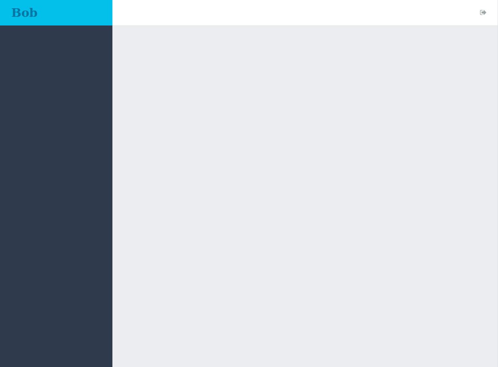
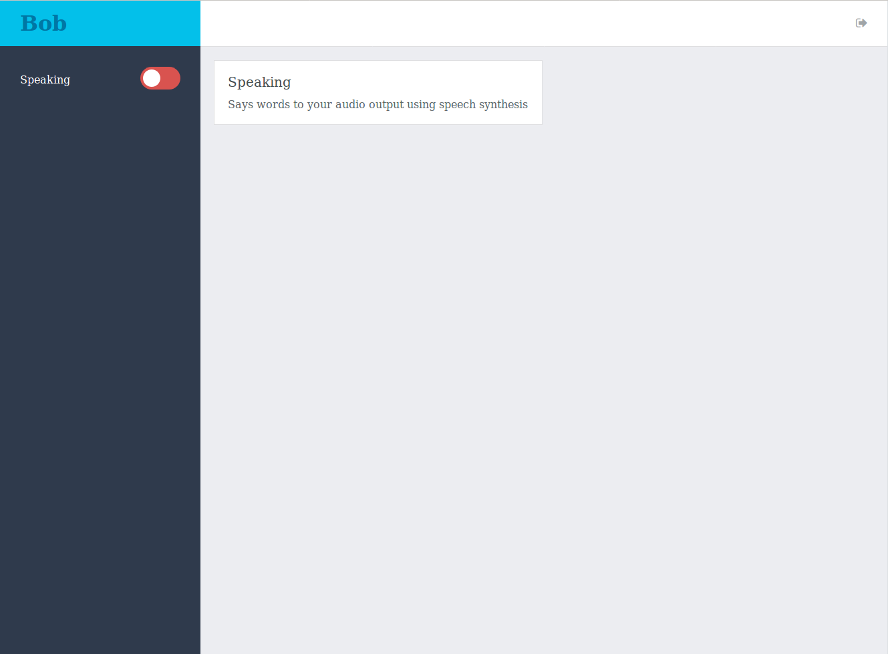
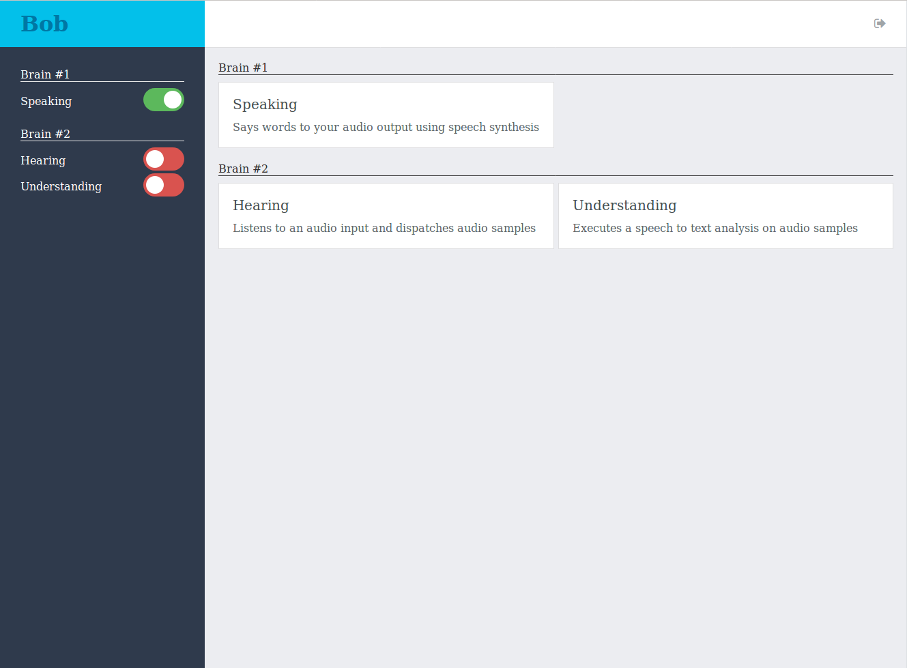
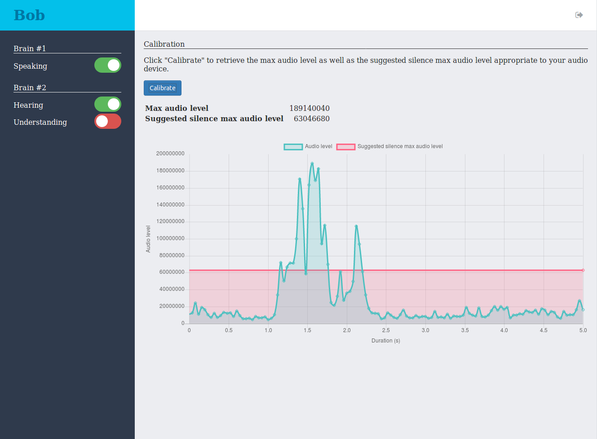
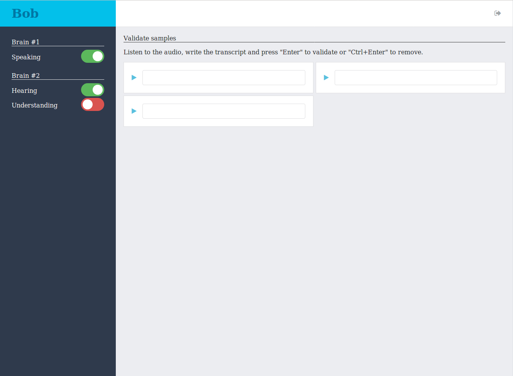

[](http://goreportcard.com/report/github.com/asticode/go-astibob)
[](https://godoc.org/github.com/asticode/go-astibob)

Bob is a framework for a distributed AI that can learn to understand your voice, speak back, interact with your mouse and keyboard, and anything else you want.

It's strongly recommended to use [DeepSpeech](https://github.com/mozilla/DeepSpeech), [PortAudio](http://www.portaudio.com) and [RobotGo](https://github.com/go-vgo/robotgo) with shipped abilities.

WARNING: the code below doesn't handle errors or configurations for readability purposes, however you SHOULD!

# More about Bob

## Overview

```
       THE WORLD            |   MACHINE #1  |        MACHINE #2        |        MACHINE #3
____________________________|_______________|__________________________|__________________________________
                            |               |                          |
                            |               |  +--------------------+  |
+------------------------+  |               |  |   Brain #1         |  |
|   Client #1 (Web UI)   |--------+   +--------|     - Ability #1   |  |
+------------------------+  |     |   |     |  |     - Ability #2   |  |
                            |  +---------+  |  +--------------------+  |
                            |  |   Bob   |  |                          |
                            |  +---------+  |                          |  +--------------------+
+------------------------+  |     |   |     |                          |  |   Brain #2         |
|   Client #2 (Web UI)   |--------+   +-----------------------------------|     - Ability #3   |
+------------------------+  |               |                          |  |     - Ability #4   |
                            |               |                          |  +--------------------+
```

## Vocabulary

- an **ability** is a simple task such as audio recording, speech-to-text analysis, speech-synthesis, etc.
- a **brain** has one or more **abilities**
- **Bob** is connected to one or more **brains**
- **Bob** interacts with **abilities** on **brains** through declared **interfaces**
- **clients** connect to **Bob** to interact with **brains** and **abilities** through the **Web UI**

## FAQ

- Why split abilities in several brains?

    Because abilities may need to run on different machines, for instance if you want to set up the **hearing** ability
    (audio recording) in different rooms of your house.

# I want to see some code

## Bob

### Create Bob

```go
// Create Bob
bob, _ := astibob.New(astibob.Configuration{})
defer bob.Close()
```

### Declare interfaces for possible abilities

```go
// Create interfaces for the abilities:
hearing := astihearing.NewInterface(astihearing.InterfaceConfiguration{})
keyboarding := astikeyboarding.NewInterface()
mousing := astimousing.NewInterface()
speaking := astispeaking.NewInterface()
understanding, _ := astiunderstanding.NewInterface(astiunderstanding.InterfaceConfiguration{})

// Declare interfaces in Bob
bob.Declare(hearing)
bob.Declare(keyboarding)
bob.Declare(mousing)
bob.Declare(speaking)
bob.Declare(understanding)
```

### Use Bob's events

```go
// Add a callback to the "ability started" event
bob.On(astibob.EventNameAbilityStarted, func(e astibob.Event) bool {
    astilog.Infof("ability %s has started on brain %s", e.Ability.Name, e.Brain.Name)
    return false
})
```

### Add a callback to an interface

```go
// Handle the results of the speech-to-text analysis made by the understanding ability
understanding.OnAnalysis(func(analysisBrainName, audioBrainName, text string) error {
    astilog.Debugf("main: processing analysis <%s>", text)
    return nil
})
```

### Send a command to a brain

```go
// Say "Yes" on the first brain with the speaking ability
bob.Exec(speaking.Say("Yes"))

// Say "Yes" on "Brain #1"
bob.ExecOnBrain(speaking.Say("Yes"), "Brain #1")
```

### Run Bob

```go
// Run Bob
bob.Run(context.Background())
```

## Brain

### Create the brain

```go
// Create brain
brain := astibrain.New(astibrain.Configuration{})
defer brain.Close()
```

### Learn an ability

```go
// Create keyboarder
keyboarder := astirobotgo.NewKeyboarder()

// Create keyboarding ability
keyboarding := astikeyboarding.NewAbility(keyboarder)

// Learn ability
brain.Learn(keyboarding, astibrain.AbilityConfiguration{})
```

### Run the brain

```go
// Run the brain
brain.Run(context.Background())
```

# Demo

## Installation

### Install Bob

Run the following command:

    $ go get -u github.com/asticode/go-astibob

### Install Espeak (LINUX ONLY)

Visit [the official website](http://espeak.sourceforge.net/).

### Install DeepSpeech

2 solutions:

- follow [this unofficial guide](https://github.com/asticode/go-astideepspeech#install-deepspeech)
- visit [the official website](https://github.com/mozilla/DeepSpeech)

### Install PortAudio

Visit [the official website](http://www.portaudio.com).

### Install RobotGo

Visit [the official website](https://github.com/go-vgo/robotgo).

## Run Bob

Run the following commands:

    $ cd $GOPATH/src/github.com/asticode/go-astibob
    $ go run demo/bob/main.go -v

Open your browser and go to `http://127.0.0.1:6969` with username `admin` and password `admin`. You should see something like this:



**Nice job, Bob is now running and waiting for brains to connect!**

## Run Brain #1

Run the following commands:

    $ cd $GOPATH/src/github.com/asticode/go-astibob
    $ go run demo/brains/1/main.go -v

If everything went according to plan, you should now see something like this in your browser:



**Nice job, Brain #1 is now running and has connected to Bob!**

## Start the speaking ability

The toggle in the menu is red which means that the **speaking** ability is not started. Ability are stopped by default.

If you want one of your ability to start when the brain starts you can use the `AutoStart` attribute of `astibrain.AbilityConfiguration`.

Start the **speaking** ability manually by clicking on the toggle next to its name: it should slide, turn green and you should hear "Hello world".

You can turn it off anytime by clicking on the toggle again.

**Nice job, the speaking ability is now started and it can now say words!**

## Run Brain #2

Run the following commands:

    $ cd $GOPATH/src/github.com/asticode/go-astibob
    $ go run demo/brains/2/main.go -v

If everything went according to plan, you should now see something like this in your browser:



**Nice job, Brain #2 is now running and has connected to Bob!**

## Calibrate the hearing ability

In order to detect spoken words, Bob needs to detect silences.

In order to detect silences, Bob needs to know the maximum audio level of a silence which is specific to your audio input.

Fortunately, the **Web UI** provides an easy way to do that.

First off, start the **hearing** ability by clicking on its toggle.

Then in your browser click on `Hearing` in the menu, click on `Calibrate`, say something and wait less than 5 seconds. You should see something like this:



You can see that in my case the maximum audio level is **189140040** and the suggested silence maximum audio level is **63046680**.

However based on the chart and what the words I've spoken, I'd rather set the silence maximum audio level to **35000000**.

Now that you have the correct value you need to update you brain's configuration: set the `SilenceMaxAudioLevel` attribute of `astihearing.AbilityConfiguration` in `demo/brains/2/main.go` to the silence maximum audio level you feel is best and restart the brain.

**Nice job, you've calibrated the hearing ability!**

## Build a DeepSpeech model for the understanding ability

In order to understand your voice, the **understanding** ability needs to use a [DeepSpeech](https://github.com/mozilla/DeepSpeech) model trained with samples of your voice.

We'll build one with the help of the **Web UI**.

### Store recorded spoken words

The first step is to tell Bob to store the spoken words it detects.

For that, you need to set the `StoreSamples` attribute of `astiunderstanding.AbilityConfiguration` in `demo/brains/2/main.go` to `true` and restart the brain.

It will store the audio samples as wav files in the directory specified by the `SamplesDirectory` attribute (`"demo/tmp/understanding"` in our case).

Now that everything is set up, return to your browser, click on `Understanding` in the menu and start the **hearing** and the **understanding** ability. Say "Bob", pause 2 seconds and repeat 2 times. Then stop the **understanding** ability.

You should now see something like this:



### Manually add transcripts for recorded spoken words

Now that spoken words have been recorded, you need to manually add their transcript.

For that, click on the first input box: it should play the spoken words. If it doesn't, make sure the browser you're using can read 32 bits wav file (which Chrome does but Firefox unfortunately doesn't for instance).

Write the exact words you've said (in our case "Bob") and press "ENTER" for each and every recorded audio. If you're not happy with what has been recorded you can press "CTRL+ENTER" and it will remove the audio samples.

You should now see your `wav` files with their transcript in `demo/tmp/understanding/validated/<date>`.

### Prepare the data for the DeepSpeech model training

Now that transcripts have been added, you need to prepare the data for the [DeepSpeech](https://github.com/mozilla/DeepSpeech) model training.

For that, run the following command:

    $ go run pkg/speechtotext/cmd/main.go -v -i demo/tmp/understanding/validated -o demo/tmp/understanding/prepared

You should now see an `demo/tmp/understanding/prepared` directory containing the proper training data.

### Train your DeepSpeech model

WARNING: I'm not a DeepSpeech nor a deep learning expert so the command below may not be the best one. Please direct your questions to the [DeepSpeech project](https://github.com/mozilla/DeepSpeech/issues) if you have any.

Now that the training data is ready, you need to train your DeepSpeech model.

For that, visit [the official repo](https://github.com/mozilla/DeepSpeech#training) and follow the guide to train a model.

Here's a simple command to train a model:

    $ python -u <DEEPSPEECH_SRC>/DeepSpeech.py \
      	--train_files demo/tmp/understanding/prepared/index.csv \
      	--dev_files demo/tmp/understanding/prepared/index.csv \
      	--test_files demo/tmp/understanding/prepared/index.csv \
      	--train_batch_size 1 \
      	--dev_batch_size 1 \
      	--test_batch_size 1 \
      	--n_hidden 494 \
      	--epoch 50 \
      	--checkpoint_dir demo/tmp/understanding/deepspeech/checkpoint \
      	--export_dir demo/tmp/understanding/deepspeech/export \
      	--alphabet_config_path demo/alphabet.txt \
      	--lm_binary_path <DEEPSPEECH_SRC>/data/lm/lm.binary \
      	--decoder_library_path <DEEPSPEECH_SRC>/native_client/build/libctc_decoder_with_kenlm.so \
      	--lm_trie_path <DEEPSPEECH_SRC>/data/lm/trie

where `<DEEPSPEECH_SRC>` is the path to your local DeepSpeech repository.

You should now have an `demo/tmp/deepspeech/export/output_graph.pb` file.

### Test your DeepSpeech model

Disable the `StoreSamples` attribute and restart the brain.

Then turn on the **hearing** and **understanding** abilities and simply say "Bob".

**Bob has responded "Yes"!**

**Congratulations, Bob can now understand you and speak back to you!**

## Interact with your mouse and keyboard

Run the following commands to start Brain #3:

    $ cd $GOPATH/src/github.com/asticode/go-astibob
    $ go run demo/brains/3/main.go -v

Start the **keyboarding** and **mousing** abilities and say "Bob" again.

**In addition to saying "Yes", Bob has now moved your mouse and typed a message!**

**Congratulations, Bob can now interact with your mouse and keyboard!**

# Shipped abilities

## Hearing

Listens to an audio input and dispatches audio samples.

### Brain

```go
// TODO Create sample reader
var r astihearing.SampleReader

// Create ability
hearing := astihearing.NewAbility(r, astihearing.AbilityConfiguration{})

// Learn ability
brain.Learn(hearing, astibrain.AbilityConfiguration{})
```

### Bob

```go
// Declare interface
bob.Declare(astihearing.NewInterface(astihearing.InterfaceConfiguration{}))

// Add a callback upon receiving audio samples
hearing.OnSamples(func(brainName string, samples []int32, sampleRate, significantBits int, silenceMaxAudioLevel float64) error {
    astilog.Infof("received audio samples from brain %s", brainName)
    return nil
}
```

## Keyboarding

Interacts with the keyboard.

### Brain

```go
// TODO Create keyboarder
var k astikeyboarding.Keyboarder

// Create ability
keyboarding := astikeyboarding.NewAbility(k)

// Learn ability
brain.Learn(keyboarding, astibrain.AbilityConfiguration{})
```

### Bob

```go
// Declare interface
bob.Declare(astikeyboarding.NewInterface())

// Type a message
bob.Exec(keyboarding.Type("Hello\nMy name is Bob\n"))

// Press keys simultaneously
bob.Exec(keyboarding.Press("v", "alt"))
```

## Mousing

Interacts with the mouse.

### Brain

```go
// TODO Create mouser
var m astimousing.Mouser

// Create ability
mousing := astimousing.NewAbility(m)

// Learn ability
brain.Learn(mousing, astibrain.AbilityConfiguration{})
```

### Bob

```go
// Declare interface
bob.Declare(astimousing.NewInterface())

// Move mouse
bob.Exec(mousing.Move(150, 200))

// Click mouse
bob.Exec(mousing.ClickLeft(true))
bob.Exec(mousing.ClickMiddle(false))
bob.Exec(mousing.ClickRight(false))

// Scroll mouse
bob.Exec(mousing.ScrollDown(10))
bob.Exec(mousing.ScrollUp(20))
```

## Speaking

Says words to the default audio output.

### Brain

```go
// TODO Create speaker
var s astispeaking.Speaker

// Create ability
speaking := astispeaking.NewAbility(s)

// Learn ability
brain.Learn(speaking, astibrain.AbilityConfiguration{})
```

### Bob

```go
// Declare interface
bob.Declare(astispeaking.NewInterface())

// Say something
bob.Exec(speaking.Say("Hello world"))
```

## Understanding

Detects spoken words out of audio samples and executes a speech-to-text analysis on them.

### Brain

```go
// TODO Create speech parser
var sp astiunderstanding.SpeechParser

// TODO Create silence detector creator
var sd func() astiunderstanding.SilenceDetector

// Create ability
understanding, _ := astiunderstanding.NewAbility(sp, sd, astiunderstanding.AbilityConfiguration{})

// Learn ability
brain.Learn(understanding, astibrain.AbilityConfiguration{})
```

### Bob

```go
// Create interface
understanding, _ := astiunderstanding.NewInterface(astiunderstanding.InterfaceConfiguration{})

// Declare interface
bob.Declare(understanding)

// Send samples
bob.Exec(understanding.Samples("my brain", []int32{}, 16000, 32, 35*1e6))

// Handle analysis
understanding.OnAnalysis(func(analysisBrainName, audioBrainName, text string) error {
    astilog.Infof("analysis %s made by brain %s out of audio samples coming from brain %s", text, analysisBrainName, audioBrainName)
}
```

# How to add your own ability

Adding your own ability is pretty straight forward. You need to add 2 things: the **ability** that will be learned by the **brain** and the **interface** that will be declared to **Bob**.

It's strongly recommended to look and understand how the shipped abilities work.

## Ability

### Basic methods

Your ability **must** implement the following interface:

```go
type Ability interface {
	Description() string
	Name() string
}
```

Your ability's name should be **unique**.

### Activable or runnable?

There are 2 types of abilities:

- **activable** abilities which means they do one-off actions. The **speaking** ability is an **activable** ability for instance.
- **runnable** abilities which means they need to run forever in the background, in a `for` loop most of the time. The **hearing** ability is a **runnable** ability for instance.

If your ability is **activable** then it needs to implement the following interface:

```go
type Activable interface {
	Activate(a bool)
}
```

If your ability is **runnable** then it needs to implement the following interface:

```go
type Runnable interface {
	Run(ctx context.Context) error
}
```

### Dispatch events to Bob

If you need your ability to dispatch events to Bob, then you need to implement the following interface:

```go
type Dispatcher interface {
	SetDispatchFunc(astibrain.DispatchFunc)
}
```

Use it to store the `astibrain.DispatchFunc` internally to use it to dispatch your events.

### Listen to Bob

If you need your ability to listen to Bob through the websocket, then you need to implement the following interface:

```go
type WebsocketListener interface {
	WebsocketListeners() map[string]astiws.ListenerFunc
}
```

## Interface

### Basic methods

Your interface **must** implement the following interface:

```go
type Interface interface {
	Name() string
}
```

The name should obviously be the same as the ability.

### Dispatch events to brains

If you need your interface to dispatch events to a brain, then you need to implement methods that return a `*astibob.Cmd` that you can then feed to the `bob.Exec` method.

### Listen to brains

If you need your interface to listen to a brain, then you need to implement the following interface:

```go
type BrainWebsocketListener interface {
	BrainWebsocketListeners() map[string]BrainWebsocketListenerFunc
}
```

### Add pages to the Web UI

If you need to add pages to the web UI, then you need to implement the following interface:

```go
type WebTemplater interface {
	WebTemplates() map[string]string
}
```

The index of the map is the relative path to the page and the value is the actual template content.

If the index of the map is `/relative/path` then the page will be available at `/web/brains/<brain name>/abilities/<ability name>/relative/path`.

If the index of the map is `/index`, then the menu as well as the homepage panel will be clickable and will redirect to this page.

The `base` javascript namespace provides several helper methods. Do checkout the shipped abilities to see how to use them.

### Add static files to the Web UI

If you need to add static files to the Web UI, then you need to implement the following interface:

```go
type StaticHandler interface {
	StaticHandlers() map[string]http.Handler
}
```

Files will be available at `/static/brains/<brain name>/abilities/<ability name>/relative/path`.

### Add API routes

If you need to add API routes for the Web UI, then you need to implement the following interface:

```go
type APIHandler interface {
	APIHandlers() map[string]http.Handler
}
```

Routes will be available at `/api/brains/<brain name>/abilities/<ability name>/relative/path`.

### Dispatch events to clients

If you need to dispatch events to clients, then you need to implement the following interface:

```go
type Dispatcher interface {
	SetDispatchFunc(astibob.DispatchFunc)
}
```

### Listen to clients

If you need to listen to clients events, then you need to implement the following interface:

```go
type ClientWebsocketListener interface {
	ClientWebsocketListeners() map[string]astiws.ListenerFunc
}
```