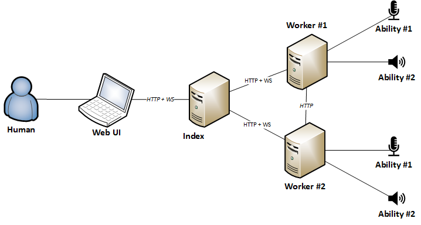

[](http://goreportcard.com/report/github.com/asticode/go-astibob)
[](https://godoc.org/github.com/asticode/go-astibob)

Golang framework to build an AI that can understand and speak back to you, and everything else you want.

WARNING: the code below doesn't handle errors for readability purposes, however you SHOULD!

# Demos

Here's a list of AIs built with `astibob` (if you're using `astibob` and want your project to be listed here, please submit a PR):

- [Official demos](https://github.com/asticode/go-astibob-demos)

# How it works

## Overview



- humans operate the AI through the **Web UI**
- the **Web UI** interacts with the AI through the **Index**
- the **Index** keeps an updated list of all **Workers** and forwards **Web UI** messages to **Workers** and vice versa
- **Workers** have one or more **Abilities** and are usually located on different machines
- **Abilities** run simple tasks such as reading an audio input (e.g. a microphone), executing speech-to-text analyses or doing speech-synthesis
- **Abilities** can communicate directly between each other even if on different **Workers**
- all communication is done via JSON messages exchanged through HTTP or Websocket

## FAQ

- Why split abilities between several workers?

    Because abilities may need to run on different machines located in different part of the world. The simplest example is wanting to read microphones inputs located in several rooms of your house. Each microphone is an ability whereas each room of your house is a worker.

# Install the project

Run the following command:

```
$ go get -u github.com/asticode/go-astibob/...
```

# I want to see some code

## Index

```go
// Create index
i, _ := index.New(index.Options{
    Server: astibob.ServerOptions{
        Addr:     "127.0.0.1:4000",
        Password: "admin",
        Username: "admin",
    },
})

// Make sure to properly close the index
defer i.Close()

// Handle signals
i.HandleSignals()

// Serve
i.Serve()

// Blocking pattern
i.Wait()
```

## Worker

```go
// Create worker
w := worker.New("Worker #1", worker.Options{
    Index: astibob.ServerOptions{
        Addr:     "127.0.0.1:4000",
        Password: "admin",
        Username: "admin",
    },
    Server: astibob.ServerOptions{Addr: "127.0.0.1:4001"},
})

// Make sure to properly close the worker
defer w.Close()

// Create runnables
r1 := pkg1.NewRunnable("Runnable #1")
r2 := pkg2.NewRunnable("Runnable #2")

// Register runnables
w.RegisterRunnables(
	worker.Runnable{
        AutoStart: true,
        Runnable:  r1,
    },
	worker.Runnable{
        Runnable:  r2,
    },
)

// Create listenables
l1 := pkg3.NewListenable(pkg3.ListenableOptions{
	OnEvent1: func(arg1 string) { log.Println(arg1) },
})
l2 := pkg4.NewListenable(pkg4.ListenableOptions{
	OnEvent2: func(arg2 string) { log.Println(arg2) },
})

// Register listenables
w.RegisterListenables(
	worker.Listenable{
        Listenable: l1,
        Runnable:   "Runnable #1",
        Worker:     "Worker #1",
    },
	worker.Listenable{
        Listenable: l2,
        Runnable:   "Runnable #3",
        Worker:     "Worker #2",
    },
)

// Handle an event and send a message to one of the runnables
w.On(astibob.DispatchConditions{
    From: astibob.NewRunnableIdentifier("Runnable #1", "Worker #1"),
    Name: astiptr.Str("Event #1"),
}, func(m *astibob.Message) (err error) {
    // Send message
    if err = w.SendMessages("Worker #1", "Runnable #1", pkg2.NewMessage1("Hello world")); err != nil {
        err = errors.Wrap(err, "main: sending message failed")
        return
    }
    return
})

// Handle signals
w.HandleSignals()

// Serve
w.Serve()

// Register to index
w.RegisterToIndex()

// Blocking pattern
w.Wait()
```

# Abilities

The framework comes with a few abilities located in the `abilities` folder:

- [Audio input](#audio-input)
- [Speech to Text](#speech-to-text)
- [Text to Speech](#text-to-speech)

## Audio input

This ability allows you reading from an audio stream e.g. a microphone.

### Dependencies<a name='audio-input-dependencies'></a>

It's strongly recommended to use [PortAudio](http://www.portaudio.com) and its [astibob wrapper](abilities/audio_input/portaudio).

To know which devices are available on the machine run:

```
$ go run abilities/audio_input/portaudio/cmd/main.go
```

### Runnable and operatable

```go
// Create portaudio
p := portaudio.New()

// Initialize portaudio
p.Initialize()

// Make sure to close portaudio
defer p.Close()

// Create default stream
s, _ := p.NewDefaultStream(portaudio.StreamOptions{
    BitDepth:             32,
    BufferLength:         5000,
    MaxSilenceLevel: 5 * 1e6,
    NumInputChannels:     2,
    SampleRate:           44100,
})

// Create runnable
r := audio_input.NewRunnable("Audio input", s)

// Register runnables
w.RegisterRunnables(worker.Runnable{
    AutoStart: true,
    Runnable:  r,
})

// Register listenables
// This is mandatory for the Web UI to work properly
w.RegisterListenables(worker.Listenable{
    Listenable: r,
    Runnable:   "Audio input",
    Worker:     "Worker #1",
})
```

### Listenable

```go
// Register listenables
w.RegisterListenables(
    worker.Listenable{
        Listenable: audio_input.NewListenable(audio_input.ListenableOptions{
            OnSamples: func(from astibob.Identifier, samples []int, bitDepth, numChannels, sampleRate int, maxSilenceLevel float64) (err error) {
                // TODO Do something with the samples
                return
            },
        }),
        Runnable: "Audio input",
        Worker:   "Worker #1",
    },
)
```

## Speech to Text

This ability allows you to execute speech-to-text analyses.

### Dependencies<a name='speech-to-text-dependencies'></a>

It's strongly recommended to install [DeepSpeech](https://github.com/mozilla/DeepSpeech) and its [astibob wrapper](abilities/speech_to_text/deepspeech).

#### I don't want to train a new model

- create a working directory (for simplicity purposes, we'll assume its absolute path is `/path/to/deepspeech`)
- download a client `native_client.<your system>.tar.xz"` matching your system at the bottom of [this page](https://github.com/mozilla/DeepSpeech/releases/tag/v0.5.1)
- create the `/path/to/deepspeech/lib` directory and extract the `client` content inside it
- create the `/path/to/deepspeech/include` directory and download [deepspeech.h](https://github.com/mozilla/DeepSpeech/raw/v0.5.1/native_client/deepspeech.h) inside it
- create the `/path/to/deepspeech/model/en` directory, and download and extract [the english model](https://github.com/mozilla/DeepSpeech/releases/download/v0.5.1/deepspeech-0.5.1-models.tar.gz) inside it
- whenever you run a worker that needs `deepspeech`, make sure to have the following environment variables:

        CGO_CXXFLAGS="-I/path/to/deepspeech/include"
        LIBRARY_PATH=/path/to/deepspeech/lib:$LIBRARY_PATH
        LD_LIBRARY_PATH=/path/to/deepspeech/lib:$LD_LIBRARY_PATH
    
#### I want to train a new model

In addition to the steps above:

- create the `/path/to/deepspeech/model/custom` directory
- run `git clone https://github.com/mozilla/DeepSpeech` inside `/path/to/deepspeech`
- [install the dependencies](https://github.com/mozilla/DeepSpeech#training-your-own-model)

### Runnable and Operatable

```go
// Create deepspeech
mp := "/path/to/deepspeech/model/en"
d := deepspeech.New(deepspeech.Options{
    AlphabetPath:   mp + "/alphabet.txt",
    BeamWidth:      1024,
    ClientPath:     "/path/to/deepspeech/DeepSpeech/DeepSpeech.py",
    LMPath:         mp + "/lm.binary",
    LMWeight:       0.75,
    ModelPath:      mp + "/output_graph.pb",
    NCep:           26,
    NContext:       9,
    PrepareDirPath: "/path/to/deepspeech/prepare",
    TrainingArgs: map[string]string{
        "checkpoint_dir":   "/path/to/deepspeech/model/custom/checkpoints",
        "dev_batch_size":   "4",
        "export_dir":       "/path/to/deepspeech/model/custom",
        "noearly_stop":     "",
        "test_batch_size":  "4",
        "train_batch_size": "20",

        // Mozilla values
        "learning_rate": "0.0001",
        "dropout_rate":  "0.15",
        "lm_alpha":      "0.75",
        "lm_beta":       "1.85",
    },
    TriePath:             mp + "/trie",
    ValidWordCountWeight: 1.85,
})

// Make sure to close deepspeech
defer d.Close()

// Initialize deepspeech
d.Init()

// Create runnable
r := speech_to_text.NewRunnable("Speech to Text", d, speech_to_text.RunnableOptions{
    SpeechesDirPath: "/path/to/speech_to_text/speeches",
})

// Initialize runnable
r.Init()

// Make sure to close the runnable
defer r.Close()

// Register runnables
w.RegisterRunnables(worker.Runnable{
    AutoStart: true,
    Runnable:  r,
})

// Send samples
w.SendMessage(worker.MessageOptions{
    Message:  speech_to_text.NewSamplesMessage(
        from,
        samples,
        bitDepth,
        numChannels,
        sampleRate,
        MaxSilenceLevel,
    ),
    Runnable: "Speech to Text",
    Worker:   "Worker #3",
})
```

### Listenable

```go
// Register listenables
w.RegisterListenables(
    worker.Listenable{
        Listenable: speech_to_text.NewListenable(speech_to_text.ListenableOptions{
            OnText: func(from astibob.Identifier, text string) (err error) {
                // TODO Do something with the text
                return
            },
        }),
        Runnable: "Speech to Text",
        Worker:   "Worker #3",
    },
)
```

## Text to Speech

This ability allows you to run speech synthesis.

### Dependencies<a name='text-to-speech-dependencies'></a>

It's strongly recommended to use [astibob wrapper](abilities/text_to_speech/speak).

If you're using Linux it's strongly recommended to use [ESpeak](http://espeak.sourceforge.net/).

### Runnable

```go
// Create speaker
s := speak.New(speak.Options{})

// Initialize speaker
s.Initialize()

// Make sure to close speaker
defer s.Close()

// Register runnables
w.RegisterRunnables(worker.Runnable{
    AutoStart: true,
    Runnable:  text_to_speech.NewRunnable("Text to Speech", s),
})

// Say something
w.SendMessage(worker.MessageOptions{
    Message:  text_to_speech.NewSayMessage("Hello world"),
    Runnable: "Text to Speech",
    Worker:   "Worker #1",
})
```

# Create your own ability

Creating your own ability is pretty straight-forward: you need to create an object that implements the **astibob.Runnable** interface. Optionally it can implement the **astibob.Operatable** interface as well.

If you want other abilities to be able to interact with it you'll need to create another object that implements the **astibob.Listenable** interface.

I strongly recommend checking out how provided abilities are built and trying to copy them first.

## Runnable

The quickest way to implement the **astibob.Runnable** interface is to add an embedded **astibob.BaseRunnable** attribute to your object. 

You can then use **astibob.NewBaseRunnable** to initialize it which allows you providing the proper options.

## Operatable

The quickest way to implement the **astibob.Operatable** interface is to add an embedded **astibob.BaseOperatable** attribute to your object.

You can then use the `cmd/operatable` command to generate an `operatable.go` file binding your `resources` folder containing your `static` and `template` files. You can finally add custom routes manually to the **astibob.BaseOperatable** using the **AddRoute** method.

## Listenable

No shortcut here, you need to create an object that implements the **astibob.Listenable** interface yourself.

# Contribute

If you've created an awesome **Ability** and you feel it could be of interest to the community, create a PR [here](https://github.com/asticode/go-astibob/compare).